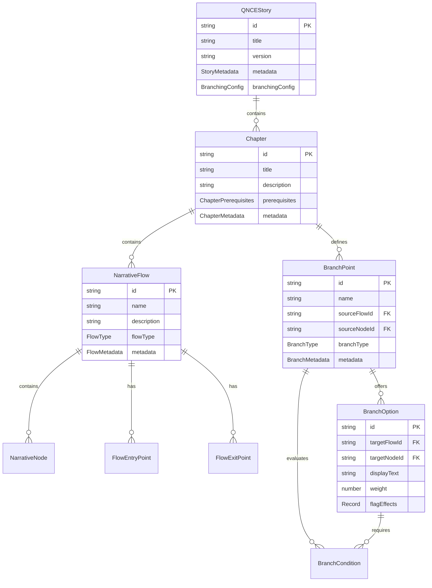
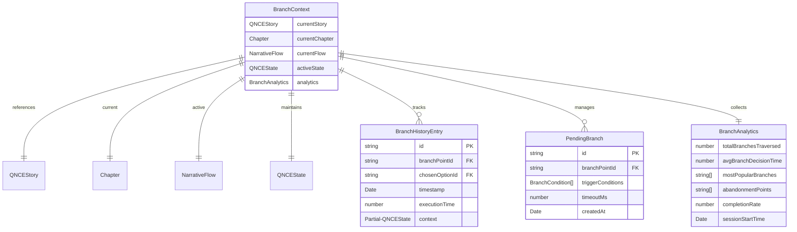
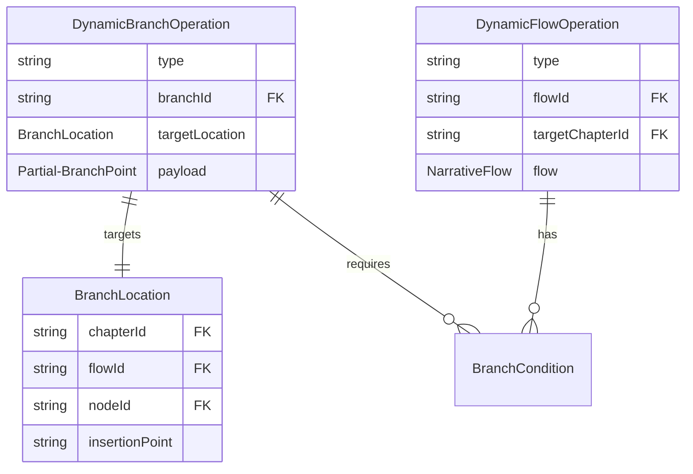
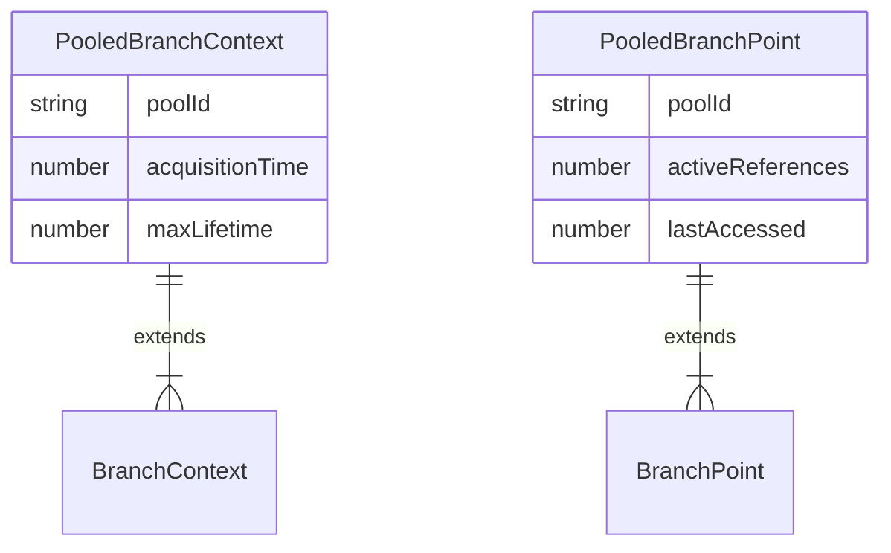
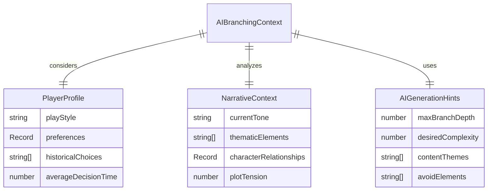

# QNCE Branching System - Entity Relationship Diagram

## Story Structure Hierarchy

## Runtime Context & State Management

## Dynamic Branching Operations

## Performance & Object Pooling Integration

## AI Integration Interfaces

## Data Flow & Relationships Summary

### Core Entity Flow
1. **QNCEStory** contains multiple **Chapters**
2. **Chapter** defines **NarrativeFlows** and **BranchPoints**
3. **NarrativeFlow** contains **NarrativeNodes** with entry/exit points
4. **BranchPoint** offers **BranchOptions** with conditions
5. **BranchContext** maintains runtime state and analytics

### Dynamic Operations
- **DynamicBranchOperation**: Insert/remove/modify branches at runtime
- **DynamicFlowOperation**: Insert/remove/modify entire flows
- Both operations use **BranchConditions** for evaluation

### Performance Integration
- **PooledBranchContext** and **PooledBranchPoint** extend core entities
- Integrated with Sprint #2 object pooling for memory efficiency
- Analytics tracking for performance monitoring

### AI Integration Points
- **AIBranchingContext** provides rich context for AI systems
- **PlayerProfile** enables personalized branching decisions
- **NarrativeContext** allows AI to understand story state
- **AIGenerationHints** guide procedural content generation

This PDM supports all Sprint #3 objectives:
- ✅ Dynamic branching mechanics
- ✅ AI integration readiness  
- ✅ Performance optimization compatibility
- ✅ Analytics and debugging support
- ✅ Procedural content generation framework
